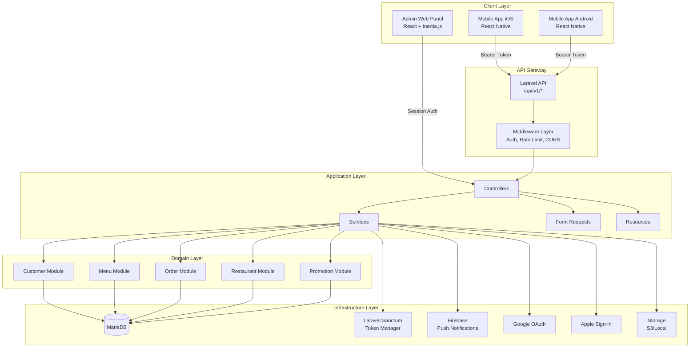
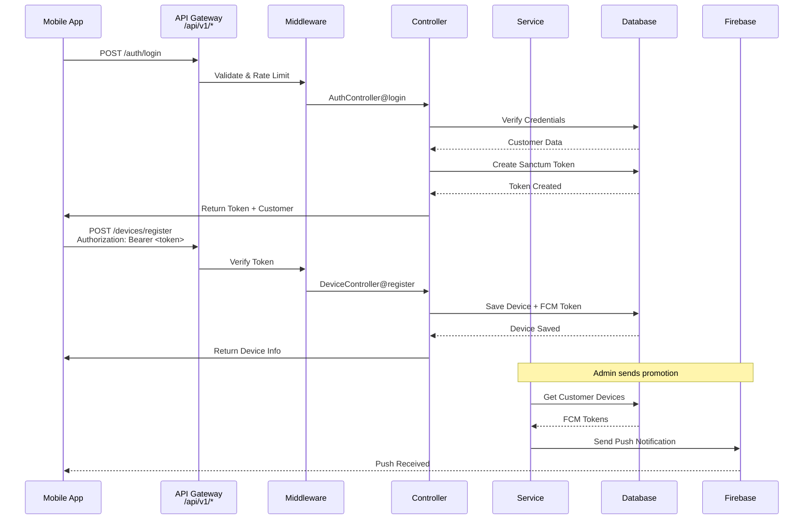
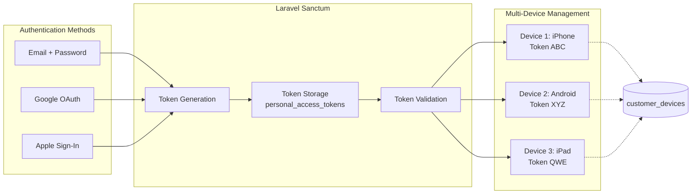
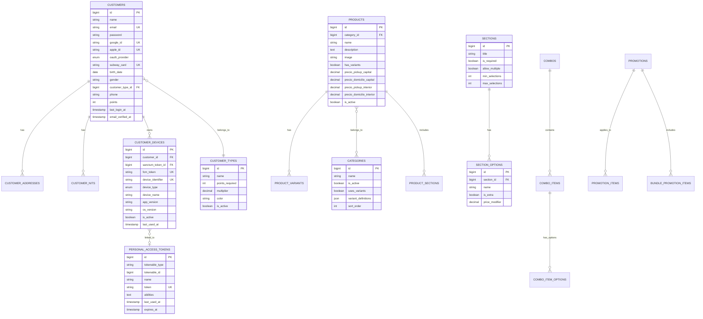
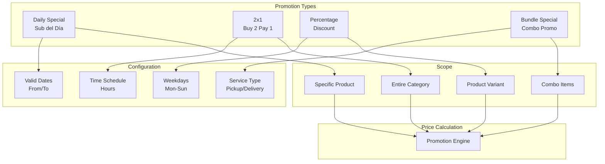
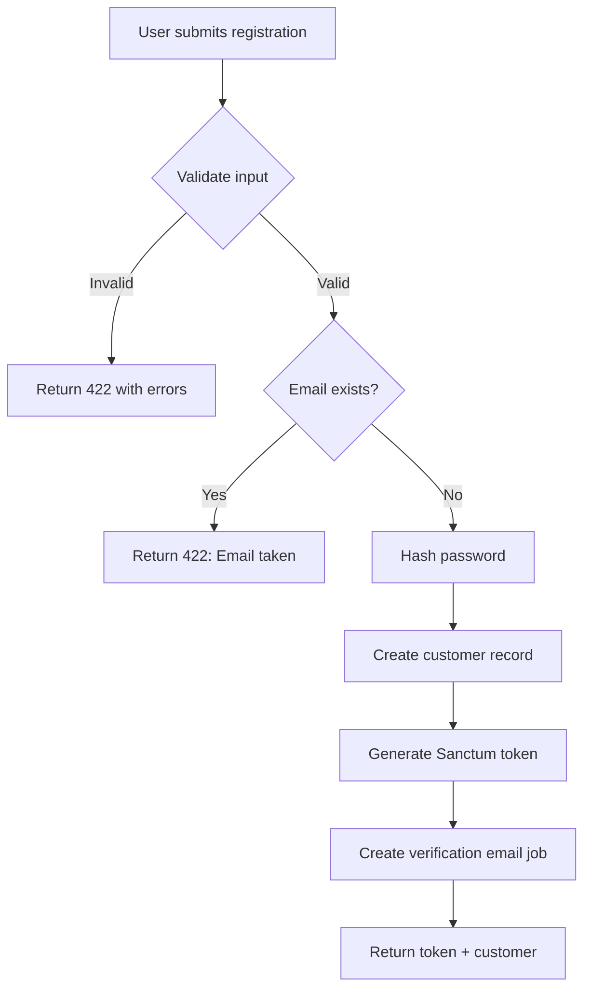
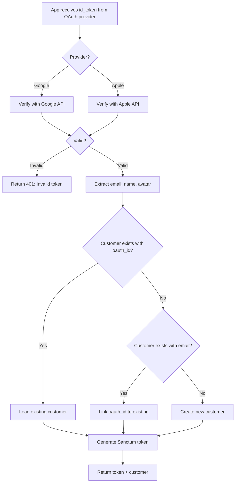
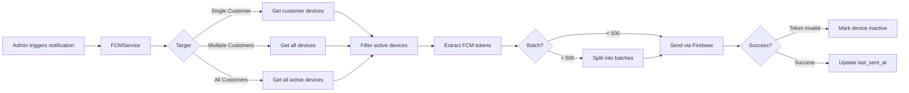
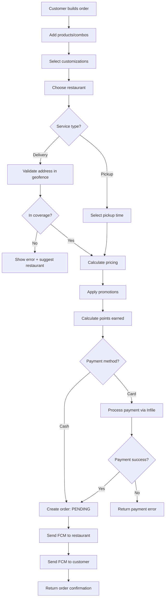

# SubwayApp - System Architecture

**Version**: 1.0
**Updated**: November 2025

---

## Table of Contents

1. [System Overview](#system-overview)
2. [Architecture Diagrams](#architecture-diagrams)
3. [Component Details](#component-details)
4. [Data Flow](#data-flow)
5. [Infrastructure](#infrastructure)
6. [Security Architecture](#security-architecture)
7. [Scalability Considerations](#scalability-considerations)

---

## System Overview

SubwayApp is a full-stack restaurant management and mobile ordering platform built for Subway Guatemala. The system consists of three main components:

1. **Admin Panel** (Web) - Restaurant management interface
2. **REST API** (Backend) - Mobile app backend
3. **Mobile App** (React Native) - Customer ordering app

### Technology Stack

```
Frontend (Admin Panel):
├── React 19
├── Inertia.js v2
├── TypeScript
├── Tailwind CSS v4
└── Vite

Backend (API + Admin):
├── Laravel 12
├── PHP 8.4
├── MariaDB
├── Laravel Sanctum (API auth)
├── Laravel Socialite (OAuth)
└── Firebase PHP SDK (Push notifications)

Mobile App:
├── React Native
├── TypeScript
└── Firebase SDK
```

---

## Architecture Diagrams

### High-Level System Architecture



### API Request Flow



### Authentication Architecture



### Database Schema (Core Tables)



### Promotion System Architecture



---

## Component Details

### 1. API Gateway Layer

**Responsibilities**:
- Route API requests to appropriate controllers
- Apply middleware (auth, rate limiting, CORS)
- Transform all responses to JSON
- Handle errors consistently

**Middleware Stack**:
```php
api.v1:
├── ForceJsonResponse         // Ensure JSON responses
├── RateLimiter               // Throttle requests
│   ├── auth: 5/min
│   ├── oauth: 10/min
│   └── api: 120/min
├── CORS                      // Cross-origin headers
└── Sanctum (auth:sanctum)    // Token validation
```

### 2. Authentication Layer

**Components**:

**AuthController**:
- Register new customers
- Login (email/password)
- Logout (single/all devices)
- Password reset flow
- Email verification

**OAuthController**:
- Google Sign-In integration
- Apple Sign-In integration
- Account linking by email
- Token generation

**Sanctum Token Manager**:
- Generate long-lived tokens (365 days)
- Store tokens with device metadata
- Validate tokens on each request
- Revoke tokens on logout

### 3. Domain Modules

#### Customer Module
```
app/Models/
├── Customer.php              // Main customer model
├── CustomerType.php          // Loyalty tiers
├── CustomerAddress.php       // Delivery addresses
├── CustomerNit.php           // Billing info
└── CustomerDevice.php        // Push notification devices

app/Http/Controllers/
├── Api/V1/
│   ├── ProfileController.php
│   └── DeviceController.php
└── CustomerController.php    // Admin panel

app/Services/
├── SocialAuthService.php     // OAuth logic
└── FCMService.php            // Push notifications
```

#### Menu Module
```
app/Models/Menu/
├── Category.php              // Sandwiches, Bebidas, etc.
├── Product.php               // Individual products
├── ProductVariant.php        // 15cm, 30cm sizes
├── Section.php               // Pan, Vegetales, Salsas
└── SectionOption.php         // Specific options

Features:
- Dynamic pricing (Pickup/Delivery × Capital/Interior)
- Product variants (sizes)
- Customization sections
- Extra charges
```

#### Combo Module
```
app/Models/Menu/
├── Combo.php                 // Combo definitions
├── ComboItem.php             // Fixed/Choice items
└── ComboItemOption.php       // Customer choices

Features:
- Fixed items (always included)
- Choice groups (customer selects)
- Single combo price
```

#### Promotion Module
```
app/Models/Menu/
├── Promotion.php             // Promotion header
├── PromotionItem.php         // 2x1, Percentage
└── BundlePromotionItem.php   // Bundle specials

Features:
- Daily specials (día-specific pricing)
- 2x1 (category-wide)
- Percentage discounts
- Bundle promotions
- Date/time/weekday restrictions
```

#### Restaurant Module
```
app/Models/
├── Restaurant.php

Features:
- GPS coordinates
- Geofencing (KML polygons)
- Delivery zone validation
- Opening hours by weekday
- Pickup/Delivery toggles
```

### 4. Infrastructure Services

#### Firebase Cloud Messaging
```php
FCMService:
├── sendToDevice($fcmToken, $data)
├── sendToCustomer($customerId, $data)
├── sendToMultipleCustomers($customerIds, $data)
└── sendToAllCustomers($data)

Features:
- Multi-device support
- Invalid token handling
- Batch sending (500/batch)
```

#### Laravel Sanctum
```
Token Management:
├── 365-day expiration
├── Device-specific naming
├── Multiple simultaneous tokens
├── Individual revocation
└── Bulk revocation (logout all)
```

#### Laravel Socialite
```
OAuth Providers:
├── Google
│   ├── Verify id_token
│   ├── Extract user data
│   └── Link/create account
└── Apple
    ├── Verify id_token
    ├── Extract user data
    └── Link/create account
```

---

## Data Flow

### Customer Registration Flow



### OAuth Login Flow



### Push Notification Flow



### Order Placement Flow (Future)



---

## Infrastructure

### Deployment Architecture

```
┌─────────────────────────────────────────┐
│         Load Balancer / CDN             │
│         (Cloudflare / AWS ALB)          │
└──────────────┬──────────────────────────┘
               │
       ┌───────┴───────┐
       │               │
┌──────▼──────┐ ┌──────▼──────┐
│ Web Server 1│ │ Web Server 2│
│  Laravel    │ │  Laravel    │
│  Nginx/PHP  │ │  Nginx/PHP  │
└──────┬──────┘ └──────┬──────┘
       │               │
       └───────┬───────┘
               │
┌──────────────▼──────────────────┐
│         Database Cluster        │
│         MariaDB Master          │
│         MariaDB Replicas        │
└─────────────────────────────────┘

┌─────────────────────────────────┐
│    External Services            │
├─────────────────────────────────┤
│  • Firebase (Push Notifications)│
│  • Google OAuth                 │
│  • Apple Sign-In                │
│  • S3 (Image Storage)           │
└─────────────────────────────────┘
```

### Environment Configuration

**Development**:
```
APP_ENV=local
APP_DEBUG=true
DB_HOST=localhost
```

**Staging**:
```
APP_ENV=staging
APP_DEBUG=true
DB_HOST=staging-db.internal
```

**Production**:
```
APP_ENV=production
APP_DEBUG=false
DB_HOST=prod-db-cluster.internal
SANCTUM_STATEFUL_DOMAINS=
```

---

## Security Architecture

### Defense in Depth

```
Layer 1: Network Security
├── HTTPS Only (TLS 1.3)
├── Firewall Rules
└── DDoS Protection

Layer 2: API Gateway
├── Rate Limiting (5-120 req/min)
├── CORS (Restricted origins)
└── Request Validation

Layer 3: Authentication
├── Laravel Sanctum (Token-based)
├── OAuth Verification (Google/Apple)
└── Password Hashing (bcrypt)

Layer 4: Authorization
├── Token Validation
├── Resource Ownership Checks
└── Admin Role Permissions

Layer 5: Data Protection
├── Encrypted Database (at rest)
├── Sensitive Field Exclusion (API Resources)
└── Soft Deletes (Data Recovery)

Layer 6: Monitoring
├── Error Logging (Laravel Log)
├── Activity Logs (User Actions)
└── Security Alerts
```

### Authentication Security

```
Password Requirements:
├── Minimum 6 characters
├── Bcrypt hashing (cost factor: 10)
└── No plaintext storage

Token Security:
├── 64-character random token
├── SHA-256 hashing
├── 365-day expiration
├── Revocable per-device
└── Last used tracking

OAuth Security:
├── Token verification with provider
├── HTTPS-only communication
├── State parameter validation
└── No client secrets in mobile
```

---

## Scalability Considerations

### Current Capacity

- **API**: 120 requests/min per user
- **Database**: Single MariaDB instance
- **Storage**: Local filesystem
- **Push Notifications**: 500 devices per batch

### Scaling Strategy

**Horizontal Scaling (Phase 1)**:
```
1. Add more web servers behind load balancer
2. Session-less API (Sanctum tokens)
3. Database read replicas
4. Redis cache for:
   - Rate limiting
   - Session storage
   - Query results
```

**Vertical Scaling**:
```
1. Upgrade database server (CPU/RAM)
2. Optimize queries (N+1 prevention)
3. Index optimization
4. Database partitioning
```

**Caching Strategy**:
```
Laravel Cache:
├── Menu Items (1 hour TTL)
├── Categories (1 hour TTL)
├── Promotions (15 min TTL)
├── Restaurants (1 hour TTL)
└── Customer Data (Session duration)

CDN:
├── Product Images
├── Static Assets
└── API Documentation
```

### Performance Optimization

**Database**:
- Eager loading (prevent N+1)
- Composite indexes on frequent queries
- Query result caching
- Soft delete indexes

**API Response**:
- Conditional resource loading
- Pagination (default 20 items)
- Field selection (sparse fieldsets)
- Response compression (gzip)

**Push Notifications**:
- Batch sending (500/batch)
- Async jobs for large sends
- Exponential backoff on failures
- Dead token cleanup (weekly)

---

## Monitoring & Observability

### Metrics to Track

**Application**:
- Response times (P50, P95, P99)
- Error rates (4xx, 5xx)
- API endpoint usage
- Token generation/revocation

**Infrastructure**:
- Server CPU/Memory
- Database connections
- Disk I/O
- Network bandwidth

**Business**:
- Customer registrations
- Login success rate
- OAuth adoption
- Push notification delivery rate

### Logging Strategy

```
Laravel Log Channels:
├── daily: Application logs (30 day retention)
├── stack: Error logs (90 day retention)
└── syslog: Security events (1 year retention)

Log Levels:
├── ERROR: Exceptions, critical failures
├── WARNING: Deprecated features, recoverable errors
├── INFO: User actions, API calls
└── DEBUG: Query logs (dev only)
```

---

## Future Architecture Enhancements

### Phase 2 (Q1 2026)

1. **Order Processing System**:
   - Real-time order tracking
   - Kitchen display system
   - Driver assignment
   - Payment processing (Infile)

2. **Loyalty Points Engine**:
   - Points accumulation
   - Points redemption
   - Tier upgrades
   - Expiration management

3. **Call Center Integration**:
   - Phone order entry
   - Customer lookup
   - Order management

### Phase 3 (Q2 2026)

1. **Advanced Analytics**:
   - Sales reports
   - Customer insights
   - Promotion effectiveness
   - Inventory predictions

2. **Microservices Split**:
   - Order Service
   - Payment Service
   - Notification Service
   - Customer Service

3. **Event-Driven Architecture**:
   - Message queue (RabbitMQ/SQS)
   - Event sourcing
   - CQRS pattern

---

## Conclusion

SubwayApp is built on a solid foundation with Laravel 12, following best practices for security, scalability, and maintainability. The architecture supports:

- ✅ Multi-channel authentication
- ✅ Real-time push notifications
- ✅ Complex business logic (promotions, combos)
- ✅ Geographic features (geofencing)
- ✅ Extensible domain model
- ✅ API-first design

The system is ready for Phase 1 (mobile app demo) and architected to scale for Phases 2-3 (orders, payments, analytics).
