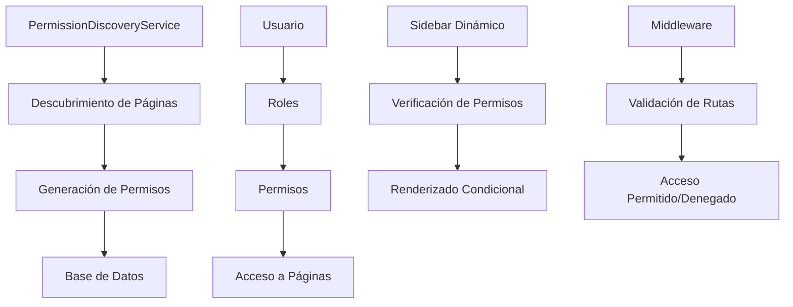
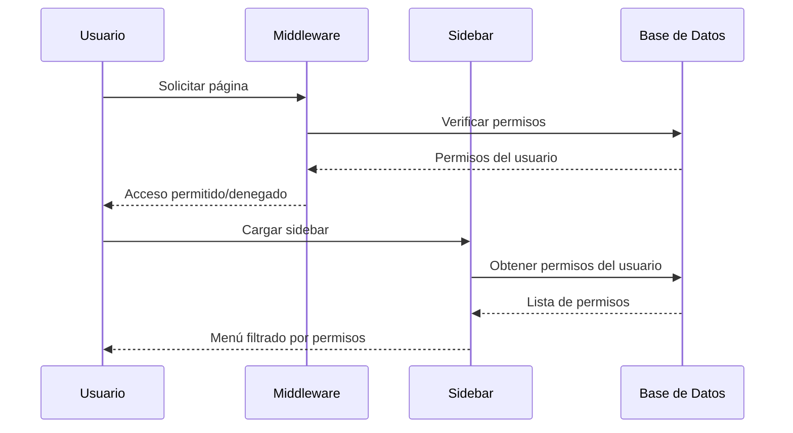

# 🛡️ Sistema de Roles y Permisos - Documentación Completa

## 📋 Índice
1. [Resumen Ejecutivo](#resumen-ejecutivo)
2. [Arquitectura del Sistema](#arquitectura-del-sistema)
3. [Funcionamiento Automático](#funcionamiento-automático)
4. [Gestión de Roles](#gestión-de-roles)
5. [Permisos Dinámicos](#permisos-dinámicos)
6. [Implementación Técnica](#implementación-técnica)
7. [Comandos y Herramientas](#comandos-y-herramientas)
8. [Casos de Uso](#casos-de-uso)
9. [Escalabilidad](#escalabilidad)

---

## 🎯 Resumen Ejecutivo

El sistema de roles y permisos de **Videra** es una solución **robusta, simple y escalable** que detecta automáticamente las páginas del sistema y genera los permisos correspondientes. El sistema está diseñado bajo los principios **DRY** y **SOLID**, garantizando mantenibilidad y extensibilidad.

### **✨ Características Principales:**
- **🔍 Detección Automática**: Escanea páginas automáticamente y genera permisos
- **🎛️ Gestión Simplificada**: Solo 4 acciones base: Ver, Crear, Editar, Eliminar
- **🎨 Interfaz Limpia**: Tabla simple con página + 4 checkboxes
- **📝 Rol Unificado**: Un solo campo de nombre (eliminada duplicidad)
- **⚡ Escalabilidad**: Se adapta automáticamente a nuevas páginas
- **🛡️ Seguridad**: Sistema RBAC completo con validaciones
- **👤 Usuario por Defecto**: Administrador con acceso completo desde instalación

---

## 🏗️ Arquitectura del Sistema

### **Componentes Principales:**



### **Flujo de Funcionamiento:**

1. **Descubrimiento**: Sistema escanea `/resources/js/pages/`
2. **Generación**: Crea permisos automáticamente (página.acción)
3. **Sincronización**: Actualiza base de datos con nuevos permisos
4. **Validación**: Middleware verifica permisos en cada ruta
5. **Renderizado**: Sidebar muestra solo opciones disponibles

---

## ⚙️ Funcionamiento Automático

### **🔍 Detección de Páginas**

El sistema escanea automáticamente el directorio `resources/js/pages/` y detecta:

- **Directorios**: Como `users/`, `roles/`, `audit/`
- **Archivos**: Como `dashboard.tsx`
- **Acciones**: Basado en archivos (`index.tsx`, `create.tsx`, `edit.tsx`)

```php
// Ejemplo de detección automática
📂 resources/js/pages/
├── 📁 users/
│   ├── 📄 index.tsx     → users.view
│   ├── 📄 create.tsx    → users.create
│   └── 📄 edit.tsx      → users.edit (+ users.delete inferido)
├── 📁 roles/
│   ├── 📄 index.tsx     → roles.view
│   ├── 📄 create.tsx    → roles.create
│   └── 📄 edit.tsx      → roles.edit (+ roles.delete inferido)
├── 📁 audit/
│   └── 📄 index.tsx     → audit.view
└── 📄 dashboard.tsx     → dashboard.view
```

### **🎛️ Acciones Base**

Cada página puede tener estas 4 acciones estándar:

| Acción | Descripción | Se Genera Cuando |
|--------|-------------|------------------|
| **`view`** | Ver/Listar elementos | Siempre (archivo `index.tsx`) |
| **`create`** | Crear nuevos elementos | Existe `create.tsx` |
| **`edit`** | Modificar elementos | Existe `edit.tsx` |
| **`delete`** | Eliminar elementos | Tiene `create` O `edit` |

### **📝 Nomenclatura de Permisos**

Los permisos siguen el patrón: `{página}.{acción}`

```php
Ejemplos:
✅ dashboard.view       → "Ver Dashboard"
✅ users.view          → "Ver Usuarios"
✅ users.create        → "Crear Usuarios"
✅ users.edit          → "Editar Usuarios"
✅ users.delete        → "Eliminar Usuarios"
✅ roles.view          → "Ver Roles y Permisos"
✅ audit.view          → "Ver Actividad"
```

---

## 👥 Gestión de Roles

### **🛡️ Rol Administrador (Sistema)**

- **Nombre**: `admin` / "Administrador"
- **Tipo**: Rol del sistema (protegido)
- **Permisos**: Todos los permisos automáticamente
- **Usuario por defecto**: `admin@admin.com` (contraseña: `admin`)
- **Características**:
  - ❌ No se puede eliminar
  - ❌ No se puede editar nombre
  - ✅ Se actualiza automáticamente con nuevos permisos

### **⚙️ Roles Personalizados**

Los usuarios pueden crear roles personalizados con combinaciones específicas de permisos. La interfaz es simple y clara:

**Visualización Simplificada:**
- Nombre del rol (único campo)
- Descripción opcional
- Tabla de permisos por página con 4 acciones: Ver, Crear, Editar, Eliminar

```
Ejemplo visual:
┌─────────────────────────────────────────────────────┐
│ Dashboard    [ ] Ver  [ ] Crear  [ ] Editar  [ ] Eliminar │
│ Usuarios     [x] Ver  [x] Crear  [x] Editar  [ ] Eliminar │
│ Actividad    [x] Ver  [ ] Crear  [ ] Editar  [ ] Eliminar │
│ Roles        [x] Ver  [ ] Crear  [ ] Editar  [ ] Eliminar │
└─────────────────────────────────────────────────────┘
```

### **👤 Usuarios Sin Roles**

- **Acceso**: Solo dashboard (`dashboard.view`)
- **Comportamiento**: Redirigidos al dashboard si intentan acceder a otras páginas
- **Mensaje**: "Contacta al administrador para asignar roles"

---

## 🔧 Permisos Dinámicos

### **📊 Estructura de Permisos**

```sql
tabla: permissions
├── id              → Clave primaria
├── name            → Identificador único (ej: "users.view")
├── display_name    → Nombre legible (ej: "Ver Usuarios")
├── description     → Descripción detallada
├── group           → Agrupación (ej: "users")
├── created_at      → Fecha de creación
└── updated_at      → Fecha de actualización

tabla: roles (simplificada)
├── id              → Clave primaria
├── name            → Nombre único y legible del rol
├── description     → Descripción opcional
├── is_system       → Si es rol del sistema
├── created_at      → Fecha de creación
└── updated_at      → Fecha de actualización
```

### **🔄 Sincronización Automática**

El sistema mantiene automáticamente sincronizados los permisos:

1. **Al ejecutar seeders**: Se ejecuta automáticamente
2. **Con comando manual**: `php artisan permissions:sync`
3. **Detección de cambios**: Nuevas páginas → nuevos permisos

### **📋 Configuración de Páginas**

```php
// En PermissionDiscoveryService.php
private array $pageConfig = [
    'dashboard' => [
        'actions' => ['view'],
        'display_name' => 'Dashboard',
        'description' => 'Panel principal del sistema'
    ],
    'users' => [
        'actions' => ['view', 'create', 'edit', 'delete'],
        'display_name' => 'Usuarios',
        'description' => 'Gestión de usuarios del sistema'
    ],
    // Se pueden agregar más páginas automáticamente...
];
```

---

## 💻 Implementación Técnica

### **🔧 Componentes Clave**

#### **1. PermissionDiscoveryService**
```php
Ubicación: app/Services/PermissionDiscoveryService.php
Función: Descubre páginas y genera permisos automáticamente
Métodos principales:
├── discoverPages()      → Escanea directorio de páginas
├── generatePermissions() → Crea array de permisos
├── syncPermissions()    → Sincroniza con BD
└── getPagesConfiguration() → Configuración completa
```

#### **2. Middleware CheckUserPermissions**
```php
Ubicación: app/Http/Middleware/CheckUserPermissions.php
Función: Valida permisos en cada ruta
Comportamiento:
├── Usuario sin roles    → Solo dashboard
├── Con permisos        → Acceso permitido
└── Sin permisos        → Redirigir con mensaje
```

#### **3. Hook usePermissions (Frontend)**
```typescript
Ubicación: resources/js/hooks/use-permissions.ts
Función: Gestión de permisos en React
Métodos:
├── hasPermission()      → Verificar permiso específico
├── hasRole()           → Verificar rol
├── isAdmin()           → Verificar si es administrador
├── canPerformAction()  → Verificar acción en página
└── getGroupedPermissions() → Permisos agrupados
```

#### **4. Sidebar Dinámico**
```typescript
Ubicación: resources/js/components/app-sidebar.tsx
Función: Renderizado condicional del menú
Características:
├── Configuración declarativa de páginas
├── Agrupación automática por permisos
└── Iconos y rutas dinámicas
```

### **🛠️ Flujo de Datos**



---

## 🔨 Comandos y Herramientas

### **⚡ Comando de Sincronización**

```bash
# Ver qué permisos se crearían (sin ejecutar)
php artisan permissions:sync --show-only

# Sincronizar permisos (con confirmación)
php artisan permissions:sync

# Sincronizar permisos (sin confirmación)
php artisan permissions:sync --force
```

**Salida del comando:**
```
🔍 Descubriendo páginas del sistema...

📄 Páginas descubiertas:
+-----------+------------------+----------------------------+----------+
| Página    | Nombre           | Acciones                   | Permisos |
+-----------+------------------+----------------------------+----------+
| dashboard | Dashboard        | view                       | 1        |
| users     | Usuarios         | view, create, edit, delete | 4        |
| audit     | Actividad        | view                       | 1        |
| roles     | Roles y Permisos | view, create, edit, delete | 4        |
+-----------+------------------+----------------------------+----------+

✅ Sincronización completada:
   📄 Páginas descubiertas: 4
   🔑 Permisos totales: 10
   ➕ Permisos creados: 0
   ✏️  Permisos actualizados: 10
```

### **🌱 Seeder Dinámico**

```bash
# Ejecutar seeder que usa sincronización automática
php artisan db:seed --class=RolesAndPermissionsSeeder
```

### **🔍 Verificación de Estado**

```bash
# Ver todos los permisos en base de datos
php artisan tinker --execute="App\Models\Permission::all(['name', 'display_name', 'group'])->toArray()"

# Ver roles y sus permisos
php artisan tinker --execute="App\Models\Role::with('permissions')->get()"

# Ver usuarios y sus roles
php artisan tinker --execute="App\Models\User::with('roles')->get(['name', 'email'])"
```

---

## 🎯 Casos de Uso

### **📋 Caso 1: Agregar Nueva Página**

**Escenario**: Desarrollador crea página `products/`

```typescript
📂 resources/js/pages/products/
├── 📄 index.tsx    (lista de productos)
├── 📄 create.tsx   (crear producto)
└── 📄 edit.tsx     (editar producto)
```

**Resultado automático**:
1. ✅ Se detecta automáticamente la página `products`
2. ✅ Se generan permisos: `products.view`, `products.create`, `products.edit`, `products.delete`
3. ✅ Rol administrador obtiene automáticamente todos los permisos
4. ✅ Sidebar se actualiza para mostrar "Productos" (si tiene permisos)

**Acción requerida**: `php artisan permissions:sync`

### **📋 Caso 2: Usuario con Permisos Limitados**

**Escenario**: Usuario "Editor" con permisos: `users.view`, `users.edit`

**Comportamiento del sistema**:
- ✅ **Dashboard**: Acceso completo
- ✅ **Usuarios**: Puede ver lista y editar usuarios
- ❌ **Usuarios**: No puede crear usuarios (botón oculto)
- ❌ **Usuarios**: No puede eliminar usuarios (botón oculto)
- ❌ **Actividad**: No aparece en sidebar
- ❌ **Roles**: No aparece en sidebar

### **📋 Caso 3: Usuario Sin Roles**

**Escenario**: Usuario recién registrado sin roles asignados

**Comportamiento del sistema**:
- ✅ **Dashboard**: Acceso completo
- ❌ **Cualquier otra página**: Redirigido al dashboard
- 📝 **Mensaje**: "No tienes permisos para acceder a esta página. Contacta al administrador para asignar roles."
- 🎨 **Sidebar**: Solo muestra "Dashboard"

---

## 🚀 Escalabilidad

### **➕ Agregar Nuevas Páginas**

El sistema es completamente escalable. Para agregar nuevas funcionalidades:

1. **Crear página en React**:
   ```typescript
   📂 resources/js/pages/inventory/
   ├── 📄 index.tsx
   ├── 📄 create.tsx
   └── 📄 edit.tsx
   ```

2. **Agregar rutas en Laravel**:
   ```php
   Route::get('inventory', [InventoryController::class, 'index'])
       ->middleware('permission:inventory.view');
   ```

3. **Ejecutar sincronización**:
   ```bash
   php artisan permissions:sync
   ```

4. **Resultado**: ¡Automáticamente disponible en el sistema de roles!

### **🎨 Personalizar Configuración**

Para páginas con configuración especial:

```php
// En PermissionDiscoveryService.php
private array $pageConfig = [
    'reports' => [
        'actions' => ['view', 'export'], // Solo ver y exportar
        'display_name' => 'Reportes',
        'description' => 'Sistema de reportes'
    ],
    'settings' => [
        'actions' => ['view', 'edit'], // Sin crear/eliminar
        'display_name' => 'Configuración',
        'description' => 'Configuración del sistema'
    ]
];
```

### **🔧 Agregar al Sidebar**

Para que aparezca en el menú:

```typescript
// En app-sidebar.tsx
const systemPages: PageConfig[] = [
    // ... páginas existentes
    {
        name: 'inventory',
        title: 'Inventario',
        href: '/inventory',
        icon: Package, // Importar desde lucide-react
        group: 'Gestión', // Opcional: agrupar
        permission: 'inventory.view'
    }
];
```

### **📊 Beneficios de la Escalabilidad**

- ✅ **Cero configuración manual** para nuevas páginas básicas
- ✅ **Consistencia automática** en nomenclatura y estructura
- ✅ **Mantenimiento reducido** - el sistema se actualiza solo
- ✅ **Flexibilidad** para configuraciones especiales cuando se necesiten
- ✅ **Seguridad por defecto** - nuevas páginas requieren permisos automáticamente

---

## 🔐 Seguridad y Mejores Prácticas

### **🛡️ Principios de Seguridad**

1. **Deny by default**: Sin permisos = sin acceso
2. **Least privilege**: Usuarios reciben solo permisos necesarios
3. **Separación de responsabilidades**: Middleware, frontend y backend validan independientemente
4. **Roles del sistema protegidos**: No se pueden eliminar roles críticos

### **✅ Mejores Prácticas**

1. **Sincronización regular**:
   ```bash
   # Ejecutar después de cada deployment
   php artisan permissions:sync --force
   ```

2. **Validación en múltiples capas**:
   - ✅ Middleware en rutas
   - ✅ Verificación en componentes React
   - ✅ Validación en controllers

3. **Usuario administrador siempre funcional**:
   - ✅ Se crea automáticamente
   - ✅ Obtiene todos los permisos automáticamente
   - ✅ No se puede eliminar su rol

4. **Auditoría completa**:
   - ✅ Cambios de roles se registran
   - ✅ Asignación de permisos se audita
   - ✅ Actividad de usuarios se rastrea

---

## 📈 Monitoreo y Mantenimiento

### **🔍 Verificación del Sistema**

```bash
# Verificar estado de permisos
php artisan permissions:sync --show-only

# Verificar usuarios sin roles
php artisan tinker --execute="App\Models\User::doesntHave('roles')->get(['name', 'email'])"

# Verificar integridad del administrador
php artisan tinker --execute="App\Models\User::where('email', 'admin@admin.com')->with('roles')->first()"
```

### **📊 Estadísticas del Sistema**

El sistema mantiene automáticamente:
- ✅ Conteo de páginas detectadas
- ✅ Total de permisos sincronizados
- ✅ Usuarios con/sin roles
- ✅ Actividad de sincronización

### **🔄 Actualizaciones Automáticas**

El sistema se mantiene actualizado automáticamente:
- 🔄 **Al ejecutar seeders**: Sincronización completa
- 🔄 **Con comando manual**: Actualización controlada
- 🔄 **Durante deployment**: Integrable en CI/CD

---

## ✨ Conclusión

El sistema de roles y permisos de **Videra** representa una solución moderna y escalable que equilibra **simplicidad**, **robustez** y **flexibilidad**. Su capacidad de auto-descubrimiento y sincronización automática garantiza que el sistema evolucione naturalmente con el crecimiento de la aplicación, manteniendo siempre la seguridad y usabilidad como prioridades principales.

**¡El sistema está listo para escalar con tu aplicación! 🚀**

---

*Documentación generada para Videra v2.0.0 - Sistema de Roles Dinámicos*  
*Fecha: Agosto 2025*  
*Autor: AI Assistant - Claude Sonnet 4*
